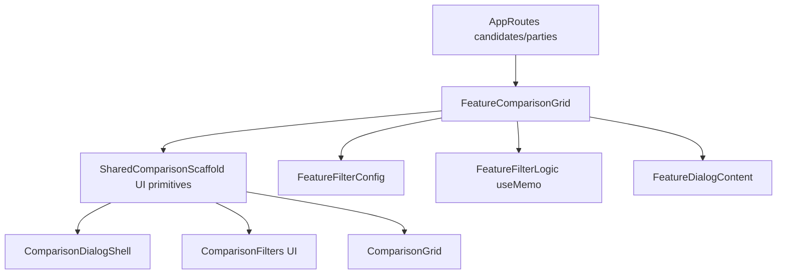

# אפיון קומפוננטות משותפות בין Candidates ו-Parties

## מה כבר משותף היום

- שכבת Shell של מסך ההשוואה בשני הפיצ'רים כמעט זהה: חיפוש, פילטרים, גריד תוצאות ו-empty state, דרך `ComparisonFilters` / `ComparisonGrid` / `ComparisonEmptyState` מתוך [`/Users/tamiralaluf/Desktop/Code/election_israel/components/shared/data-display/comparison-shared.tsx`](/Users/tamiralaluf/Desktop/Code/election_israel/components/shared/data-display/comparison-shared.tsx).
- כרטיסי התצוגה מאוחדים בפועל דרך `ComparisonProfileCard`: גם `PartyCard` וגם `LeaderCard` רק ממפים שדות (`image/name/subtitle`). רלוונטי בקבצים [`/Users/tamiralaluf/Desktop/Code/election_israel/features/parties/components/card.tsx`](/Users/tamiralaluf/Desktop/Code/election_israel/features/parties/components/card.tsx), [`/Users/tamiralaluf/Desktop/Code/election_israel/features/candidates/components/comparison-grid.tsx`](/Users/tamiralaluf/Desktop/Code/election_israel/features/candidates/components/comparison-grid.tsx).
- מעטפת הדיאלוג והסקשנים הקולפסיביים כבר משותפים (`ComparisonDialogShell`, `ComparisonCollapsibleSection`) באותו קובץ shared.
- `app` routes לשני הפיצ'רים זהים במבנה wrapper ורק מחליפים grid component: [`/Users/tamiralaluf/Desktop/Code/election_israel/app/candidates/page.tsx`](/Users/tamiralaluf/Desktop/Code/election_israel/app/candidates/page.tsx), [`/Users/tamiralaluf/Desktop/Code/election_israel/app/parties/page.tsx`](/Users/tamiralaluf/Desktop/Code/election_israel/app/parties/page.tsx).

## מה משותף ברמת דומיין (ועדיין לא ממוסגר כ-shared)

- לוגיקת הסינון בשני ה-grids עובדת באותו Pipeline:
  - `searchQuery` על 2 שדות טקסט.
  - פילטרים רב-ערכיים (`string[]`) על ערכי taxonomy.
  - יצירת `filteredItems` ב-`useMemo`.
  - פתיחת `selectedItem` בדיאלוג.
- קונפיגורציות פילטרים בנויות באותה צורה (`key`, `placeholder`, `options`, `onValuesChange`) בשני הקבצים:
  - [`/Users/tamiralaluf/Desktop/Code/election_israel/features/candidates/components/comparison-filters.ts`](/Users/tamiralaluf/Desktop/Code/election_israel/features/candidates/components/comparison-filters.ts)
  - [`/Users/tamiralaluf/Desktop/Code/election_israel/features/parties/components/comparison-filters.ts`](/Users/tamiralaluf/Desktop/Code/election_israel/features/parties/components/comparison-filters.ts)
- יש דמיון UI גבוה גם בין תוכן הדיאלוגים ברמת “שורות label/value”, כאשר ל-`parties` יש הרחבות ייעודיות (קרוסלות, חברי מפלגה, חוקים), ול-`candidates` יש סקשנים ביוגרפיים.

## גבולות אחריות מוצעים (להימנע מ-over-sharing)

- **יישאר Shared:**
  - primitives ו-layout blocks: חיפוש, פילטר toolbar, גריד, empty state, dialog shell, section wrappers.
  - presenter פשוט של card identity (`image/title/subtitle`).
- **יישאר Feature-specific:**
  - תוכן דיאלוגים העסקי (promises/recent actions/members/issues מול vision/education/career).
  - mapping דומיין (למשל `getGovernmentIntegrationsLabel`, `lawFilters`).
- **Shared “smart” במינון נמוך:**
  - abstraction קטן ל-state pattern של comparison page (state + callbacks), בלי להכניס חוקים עסקיים לשכבת shared.

## קומפוננטות חדשות להוספה ל-shared

- `ComparisonSearchBox` — תת-קומפוננטה מופרדת לשדה החיפוש.
- `ComparisonMultiSelectFilter` — תת-קומפוננטה כללית לפילטר רב-בחירה.
- `ComparisonLawFilter` — תת-קומפוננטה ייעודית לפילטר “חוקים”.
- `ComparisonScaffold` — תבנית עמוד אחידה שמחברת `Filters + Grid + EmptyState`.

## פירוקים מבניים שנכנסים לתכנית

- להוציא את `LeaderDialog` מתוך [`/Users/tamiralaluf/Desktop/Code/election_israel/features/candidates/components/comparison-grid.tsx`](/Users/tamiralaluf/Desktop/Code/election_israel/features/candidates/components/comparison-grid.tsx) לקומפוננטה עצמאית תחת `features/candidates/components/dialog.tsx`.
- לפרק את [`/Users/tamiralaluf/Desktop/Code/election_israel/components/shared/data-display/comparison-shared.tsx`](/Users/tamiralaluf/Desktop/Code/election_israel/components/shared/data-display/comparison-shared.tsx) למספר קבצים קטנים לפי תחומי אחריות במקום “God file”.
- לשמור קובץ `index`/barrel בתוך `components/shared/data-display/` ל-export מרוכז, כדי לא לשבור import paths בכל הפיצ'רים.

## תכנית עבודה הדרגתית

1. להוציא את `LeaderDialog` לקובץ ייעודי, ולשמור `comparison-grid` ממוקד בלוגיקת סינון/רשימה בלבד.
2. לפרק את `comparison-shared.tsx` לתת-קבצים:
   - `comparison-image.tsx`
   - `comparison-profile-card.tsx`
   - `comparison-dialog-shell.tsx`
   - `comparison-collapsible-section.tsx`
   - `comparison-search-box.tsx`
   - `comparison-multi-select-filter.tsx`
   - `comparison-law-filter.tsx`
   - `comparison-filters.tsx`
   - `comparison-grid.tsx`
   - `comparison-empty-state.tsx`
3. לייצר “contract” אחיד ל-comparison entities (UI-facing בלבד), למשל `ComparisonListItem` עם מזהה, כותרת, subtitle, image, בלי לגעת בטיפוסים מקוריים.
4. לחלץ hook משותף לניהול state חוזר של comparison list (`search`, `selected`, `open/close`) עם API גנרי.
5. ליישר naming conventions:
   - `economyFilter`/`economicFilter` לאותו שם.
   - `lawFilters` vs `...Filter` naming עקבי.
6. ליצור את `ComparisonSearchBox`, `ComparisonMultiSelectFilter`, `ComparisonLawFilter` ולהרכיב מהם `ComparisonFilters` דק יותר.
7. ליצור `ComparisonScaffold` כ-wrapper שימושי ל-`filters`, `grid` ו-`empty state`.
8. להוסיף שכבת `features/*/config` עבור הגדרות פילטרים, כך שה-shared UI יקבל רק config ולא ידע דומיין.

## תרשים החלטות שכבות

## קריטריוני הצלחה לאפיון

- כל רכיב משויך חד-משמעית ל-`shared` או `feature` לפי אחריות (UI primitive מול business content).
- שני הפיצ'רים ממשיכים להיראות זהים ויזואלית למסכים הקיימים.
- ירידה בכפילות state/patterns ב-`comparison-grid` בלי פגיעה בקריאות הקוד.
- הוספת feature שלישי בעתיד תדרוש בעיקר config + dialog content, ולא שכפול scaffold.
