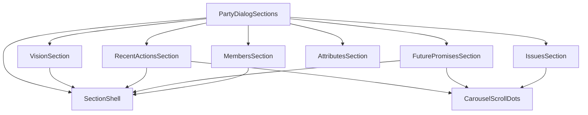

# פירוק `ComparisonCollapsibleSection` לקומפוננטות חיצוניות

## מטרת השינוי

להוציא את ה־sections מתוך [`/Users/tamiralaluf/Desktop/Code/election_israel/features/parties/components/dialog-sections.tsx`](/Users/tamiralaluf/Desktop/Code/election_israel/features/parties/components/dialog-sections.tsx) לקומפוננטות עצמאיות, כך שהמעטפת תהיה אחידה וגנרית, ורק תוכן הסקשן ישתנה בין רכיבים.

## מצב נוכחי (בקצרה)

- הקובץ [`/Users/tamiralaluf/Desktop/Code/election_israel/features/parties/components/dialog-sections.tsx`](/Users/tamiralaluf/Desktop/Code/election_israel/features/parties/components/dialog-sections.tsx) כולל 6 `ComparisonCollapsibleSection` שונים עם לוגיקה ועיצוב פנימי מעורבבים.
- תבנית חוזרת כמעט בכל הסקשנים: `ComparisonCollapsibleSection` + מעטפת `div` עם `p-3 rounded-lg bg-muted/30` + תוכן.
- חלק מהסקשנים כוללים וריאציות מורכבות יותר (קרוסלה עם dots, רשימות ערכים, גריד חברי מפלגה).

## ארכיטקטורה מוצעת

- `SectionShell` יהיה רכיב מעטפת גנרי לפיצ'ר מפלגות שמכיל:
  - `ComparisonCollapsibleSection`
  - מעטפת תוכן אחידה (`p-3 rounded-lg bg-muted/30`) עם אפשרות opt-out כשצריך (למשל sections של רשימות/קרוסלה שכבר מעוצבות אחרת).
- כל section יהפוך לרכיב ייעודי חיצוני שמקבל props מינימליים ומכיל רק את לוגיקת התוכן שלו.

## חלוקת קבצים מוצעת

- להוסיף תיקיה: [`/Users/tamiralaluf/Desktop/Code/election_israel/features/parties/components/dialog-sections/`](/Users/tamiralaluf/Desktop/Code/election_israel/features/parties/components/dialog-sections/)
- קבצים חדשים:
  - `section-shell.tsx`
  - `carousel-scroll-dots.tsx`
  - `vision-section.tsx`
  - `recent-actions-section.tsx`
  - `future-promises-section.tsx`
  - `members-section.tsx`
  - `attributes-section.tsx`
  - `issues-section.tsx`
  - `index.ts`
- קובץ קיים שיתכווץ להרכבה בלבד:
  - [`/Users/tamiralaluf/Desktop/Code/election_israel/features/parties/components/dialog-sections.tsx`](/Users/tamiralaluf/Desktop/Code/election_israel/features/parties/components/dialog-sections.tsx)

## שלבי יישום

1. להוציא תחילה רכיבי תשתית משותפים:
   - `SectionShell` (מעטפת אחידה + props כמו `title`, `defaultOpen`, `children`, ו־`contentClassName` אופציונלי).
   - `CarouselScrollDots` לקובץ נפרד לשימוש בכל הסקשנים עם קרוסלה.
2. לפרק sections פשוטים תחילה (`Vision`, `Members`, `Attributes`) כדי לייצב API.
3. לפרק sections מורכבים (`RecentActions`, `FuturePromises`, `Issues`) תוך שמירה מלאה על:
   - RTL ו־carousel opts
   - חישובי slides ומספור פריטים
   - empty states הקיימים.
4. להשאיר ב־`PartyDialogSections` רק:
   - חישובי נתונים/נגזרות משותפים שנדרשים במספר sections
   - קומפוזיציה של רכיבי הסקשן בסדר הקיים.
5. ניקוי imports וייצוא דרך `index.ts` כדי לשמור על import paths נקיים.

## חוזה Props מוצע (כיוון)

- sections מבוססי טקסט יקבלו ערך מוכן להצגה (ללא תלות ב־`party` מלא כשלא צריך).
- sections מורכבים יקבלו רק את הדאטה הנדרש להם (למשל `items`, `partyId`, `api/setApi` אם רלוונטי).
- `PartyDialogSections` יישאר orchestrator שמכין את הנתונים ומעביר לכל רכיב.

## קריטריוני קבלה

- `dialog-sections.tsx` נעשה קצר וממוקד קומפוזיציה (ללא JSX ארוך לכל section).
- לכל `ComparisonCollapsibleSection` בדיאלוג מפלגות יש רכיב חיצוני משלו.
- קיימת מעטפת עיצוב אחידה משותפת לכל sections, עם אפשרות התאמה נקודתית.
- התנהגות UI נשמרת: פתיחה/סגירה, קרוסלות, dots, RTL, empty states.
- אין שינוי בפלט התוכן או במבנה העסקי של הנתונים.
