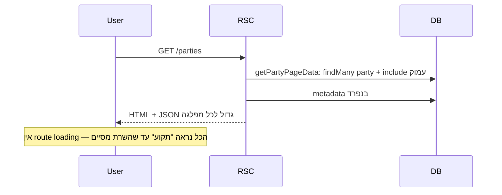

# שיפור יעילות טעינה — דף השוואת מפלגות

## אבחון מקצר (מה שקורה היום)

- [getPartyPageData](lib/data/party-comparison.ts) מריץ במקביל `getPartiesForComparison` + `getPartyFilterMetadata`. ה-`include` ([`partyInclude`](lib/data/party-comparison.ts) שורות 43–60) שולף לכל מפלגה: `baseTopics` (עם `topic`+`option`), `legislations` (עם `legislation.group` וכו'), `members`, `recentActions`, `futurePromises` — ואז [mapParty](lib/data/party-comparison.ts) הופך את הכל ל-`PartyComparisonRow` **המלא** שמועבר ל-`"use client"` — כלומר **כל** זה מסוּכָּם ב-RSC payload לדפדפן, גם לפני שלחצו על מפלגה.

- [חוסר `loading.tsx`](app/parties) — Next לא מציג `loading` route, אז עד שסיימו [הדף](app/parties/page.tsx) אין UI חלופי; זה בולט במיוחד ב־`npm run dev` (קומפילציה + cold Prisma).

- [ComparisonImage](components/shared/data-display/comparison-image.tsx): `width={2048} height={2048}` מול `sizes="128px"` — התמונה **מצוירת** כ־~128px אבל המטא-דאטה מבלבלת; קבצי ‎`public/parties/*` לעיתים PNGים כבדים, ו-**כל** הכרטיסים טוענים ריבוי תמונות בו-זמנית (אין `priority` סלקטיבי / lazy ברור).

---

## ציר 1: תחושה מיידית (ביצירת ערך גבוה, סיכון נמוך)

1. **הוספת [`app/parties/loading.tsx`](app/parties/loading.tsx)**  
   שלד שמתאים ל־[ComparisonGrid](components/shared/data-display/comparison-grid.tsx) (רשת 2/3 עמודות) + Placeholder לפילטרים, כך שהמשתמש רואה מבנה בזמן `await getPartyPageData()`.

2. **כיוון `next/image` לגודל אמיתי**  
   ב־[comparison-image.tsx](components/shared/data-display/comparison-image.tsx) להתאים `width`/`height` ל־2× או 3× רזולוציית תצוגה (למשל 256) במקום 2048, ולוודא `sizes` עקבי. זה מקטין עבודת המרה/הורדה ומשפר LCP/משקל דקוד.

3. **נכסי תמונות (מחוץ לקוד)**  
   אם ה-PNGs גדולים מדי, לשקול WebP/AVIF או דחיסה; זה אינו שינוי קוד אבל מוריד בולטות את זמן הרשת.

4. (אופציונלי) **Dynamic import לדיאלוג**  
   `next/dynamic` + `ssr: false` ל־[PartyDialog](features/parties/components/dialog.tsx) כך ש-JS הכבד (קרוסלה, וכו') ייטען **אחרי** צביעת הגריד — שיפור ב-First Load JS, במחיר micro-delay בפתיחת מודאל ראשונה.

---

## ציר 2: הקטנת TTFB וייעול DB (בינוני)

5. **דילול שאילתה לרשימה**  
   לעדכן את `getPartiesForComparison` (או לפצל לפונקציה חדשה) כך ש-`prisma.party.findMany` ישתמש ב-`select` ממוקד רק לשדות שבהם [mapParty](lib/data/party-comparison.ts) **באמת** משתמש, ויוריד `include`ים מיותרים (למשל מודלים מלאים של `topic`/`legislation` אם הערכים נגזרים מ-join טבלאות הביניים).
   - זה מקצר זמן שאילתה, פחות זיכרון ב-Node, פחות סריאליזציה.

6. **מטמון**
   - `import { cache } from "react"` סביב `getPartyPageData` (או סביב השכבה של Data) — מונע בקשות כפולות **באותו request** אם היא נקראת מכמה מקומות.
   - `unstable_cache` (או `revalidate` ברמת route) **אם** הנתונים לא חייבים בזמן אמת — מתאים לפרודקשן כשהעדכונים נדירים; **לא** מתאים אם ה-CMS/DB משתנים בלי פירסום מחדש.

7. **התנהגות דינמית**  
   [דף מועמדים](app/candidates/page.tsx) מגדיר `force-dynamic`. לדון אם [מפלגות](app/parties/page.tsx) אמור להיות static עם revalidate או dynamic — זה משפיע על build vs runtime; לא מניחים לכם החלטה (תלוי במקור אמת לנתונים).

---

## ציר 3: ארכיטקטורה — "רשימה קלה, פרט כבד" (השפעה הכי גדולה על payload)

8. **הגדרת טייפ/שאילתה ל"כרטיס בלבד"**  
   למשל: `id`, `name`, `leader`, `image`, `baseTopicByTitle`, `legislationById` (לסינון) — **בלי** `members`, `recentActionsItems`, `futurePromisesItems`, `vision` לרשת הראשית.

9. **טעינת פרטים לדיאלוג on-demand**  
   כאשר `openParty` — `fetch` ל-API route (או Server Action) שמחזיר `PartyDetail` לפי `id` עם ה-include הכבד, או פתיחת [parallel route / intercepting route] — pattern קיים ב-App Router.
   - **יתרון**: RSC/הידרציה מקבלים **פי עשר** פחות JSON בלחיצה ראשונה.
   - **מחיר**: עבודה על מסלול טעינה שני, states של loading/error בדיאלוג.

רצף מומלץ ליישום: **(1) → (2) → (5) → (8+9)** או לחלופין 1+2+8+9 אם העדיפות היא "לא להמתין לכל הכבד" לפני DB יעול.

---

## קבצים מרכזיים

| קובץ                                                                                                                                                                  | קשר                                    |
| --------------------------------------------------------------------------------------------------------------------------------------------------------------------- | -------------------------------------- |
| [app/parties/page.tsx](app/parties/page.tsx)                                                                                                                          | נקודת הכניסה, `await` חוסם             |
| [lib/data/party-comparison.ts](lib/data/party-comparison.ts)                                                                                                          | `getPartyPageData`, `partyInclude`     |
| [components/shared/data-display/comparison-image.tsx](components/shared/data-display/comparison-image.tsx)                                                            | מימדי Image                            |
| [features/parties/components/party-comparison-grid.tsx](features/parties/components/party-comparison-grid.tsx) + [dialog.tsx](features/parties/components/dialog.tsx) | היכן לחבר dynamic import + טעינה דחויה |

לא נדרש שינוי ב־[next.config.mjs](next.config.mjs) אלא אם מוסיפים `images.remotePatterns` ל-URLs מרחוק; כרגע `imageUrl` בדטה-בייס כנראה מקומי (`/parties/...`).
